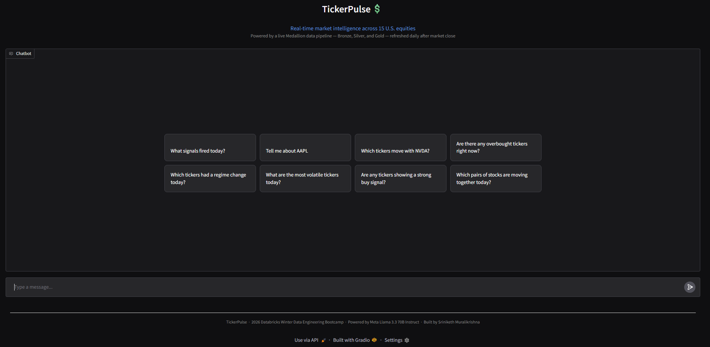
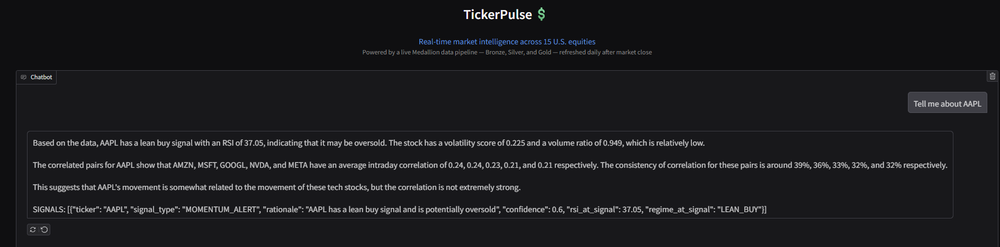
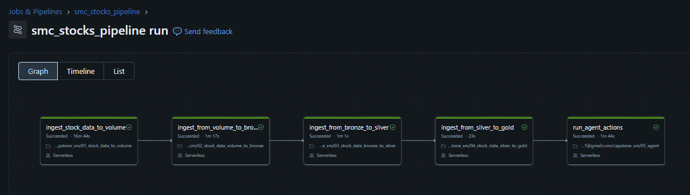
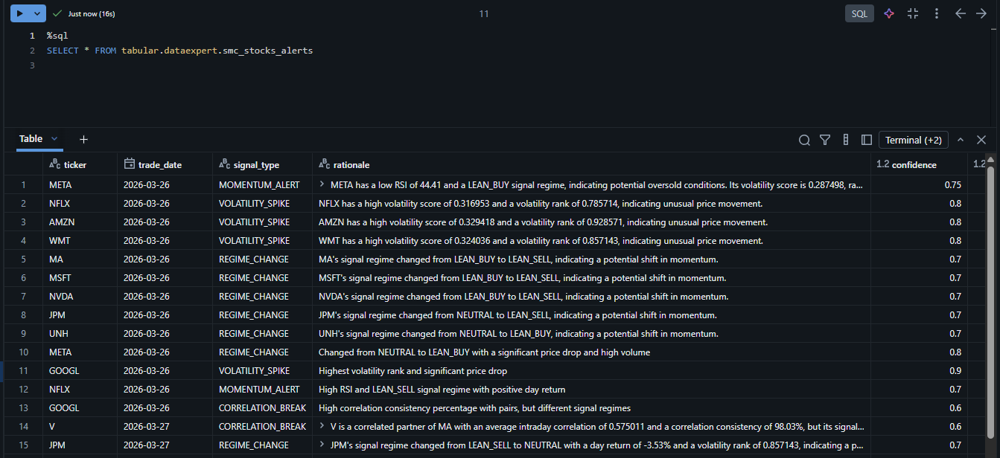

# TickerPulse — Stock Market Intelligence Agent

> A production-grade, real-time stock analytics pipeline built on Databricks, powered by an autonomous AI agent that monitors 15 U.S. equities and generates trading signals daily.



---

## What is TickerPulse?

TickerPulse is a full-stack data engineering and AI capstone project built on Databricks. It ingests a full year of minute-level stock data from the Polygon.io API, processes it through a Medallion Architecture (Bronze → Silver → Gold), and runs an autonomous LLM-powered agent that scans the enriched data every day after market close and writes structured trading signals to a Delta alerts table.

The project is interactive — a Gradio chat UI (deployed as a Databricks App) lets you ask the agent questions about today's signals, specific tickers, or correlated pairs in plain English.

---

## Live Demo



**Example questions you can ask:**
- *"What signals fired today?"*
- *"Tell me about AAPL"*
- *"Which tickers move with NVDA?"*
- *"Are there any overbought tickers right now?"*
- *"Which tickers had a regime change today?"*
- *"What are the most volatile tickers today?"*

---

## Tickers Covered

15 U.S. equities across 6 sectors:

### Technology
| Ticker | Company |
|--------|---------|
| AAPL | Apple Inc. |
| MSFT | Microsoft Corporation |
| GOOGL | Alphabet Inc. |
| NVDA | NVIDIA Corporation |
| META | Meta Platforms Inc. |

### Consumer Discretionary
| Ticker | Company |
|--------|---------|
| AMZN | Amazon.com Inc. |
| TSLA | Tesla Inc. |
| NFLX | Netflix Inc. |

### Financials
| Ticker | Company |
|--------|---------|
| JPM | JPMorgan Chase & Co. |
| V | Visa Inc. |
| MA | Mastercard Incorporated |

### Healthcare
| Ticker | Company |
|--------|---------|
| UNH | UnitedHealth Group Inc. |
| JNJ | Johnson & Johnson |

### Consumer Staples
| Ticker | Company |
|--------|---------|
| WMT | Walmart Inc. |

### Energy
| Ticker | Company |
|--------|---------|
| XOM | ExxonMobil Corporation |

---

## Architecture

TickerPulse follows the **Medallion Architecture** — a layered data design pattern where raw data is progressively cleaned, enriched, and served through Bronze, Silver, and Gold Delta tables.

```
Polygon.io API
      │
      ▼
 Volume Landing Zone          ← raw Parquet files partitioned by ticker/date
      │
      ▼ (Auto Loader — Spark Structured Streaming)
  Bronze Layer                ← raw 1-min OHLCV bars, append-only, idempotent upsert
      │
      ▼ (PySpark batch + window functions + UDFs)
  Silver Layer                ← daily OHLCV aggregation, RSI, volatility, pair correlation
      │
      ▼ (Delta MERGE INTO)
   Gold Layer                 ← joined serving table, volatility rank, pair context
      │
      ▼ (LLM agent — Meta Llama 3.3 70B)
  Alerts Table                ← structured trading signals with rationale + confidence
      │
      ▼
  TickerPulse Gradio UI       ← Databricks App — chat with the agent
```


---

## Data Pipeline — Medallion Layers

### Bronze — Raw Ingestion

| Property | Detail |
|----------|--------|
| Source | Polygon.io REST API (v2 Aggregates, 1-min bars) |
| History | 365 calendar days per ticker (~98,000 bars per ticker) |
| Transport | Parquet files → Databricks Volume → Auto Loader stream |
| Write mode | Idempotent upsert via `foreachBatch` + Delta MERGE INTO |
| Merge keys | `ticker` + `timestamp` |
| Audit cols | `file_source`, `bronze_ingestion_timestamp` |

**Schema:** `ticker`, `timestamp`, `trade_date`, `open`, `high`, `low`, `close`, `volume`, `vwap`, `transactions`

---

### Silver — Enrichment & Feature Engineering

Two Delta tables at different grains:

#### `smc_stocks_silver_metrics` — grain: ticker + trade_date

| Feature | Description |
|---------|-------------|
| OHLCV aggregation | Minute bars collapsed to daily summaries using `sort_array` + `collect_list` to correctly capture `day_open` (first bar) and `day_close` (last bar) |
| RSI | 14-period Relative Strength Index via Python UDF over intraday close array. Wilder smoothing applied. |
| Volatility score | Annualized intraday volatility: std dev of minute returns × sqrt(252 × 390). Measures daily price wiggle normalized to a yearly figure. |
| Signal regime | Rule-based label combining RSI thresholds and volume-vs-average ratio: `STRONG_BUY`, `BUY`, `LEAN_BUY`, `NEUTRAL`, `LEAN_SELL`, `SELL`, `STRONG_SELL`, `UNKNOWN` |
| Lag features | `prev_regime`, `prev_rsi`, `prev_close`, `regime_changed`, `day_return_pct` via `Window.partitionBy("ticker").orderBy("trade_date")` |

#### `smc_stocks_silver_pairs` — grain: ticker_a + ticker_b + trade_date

| Feature | Description |
|---------|-------------|
| Pair construction | Minute returns self-joined on `(trade_date, timestamp)` with `ticker_a < ticker_b` constraint — produces all N×(N-1)/2 unique pairs (105 pairs for 15 tickers) |
| Intraday correlation | Pearson correlation of minute-level returns per pair per day |
| Return divergence | Average absolute difference of minute returns between the two tickers |

---

### Gold — Serving Layer

Two Delta tables optimized for querying and agent consumption:

#### `smc_stocks_gold` — grain: ticker + trade_date

Joins silver metrics with cross-ticker pair context into a single wide fact table:

| Column | Description |
|--------|-------------|
| All OHLCV columns | From silver metrics |
| `rsi`, `volatility_score` | From silver metrics |
| `signal_regime`, `prev_regime`, `regime_changed` | From silver metrics |
| `day_return_pct`, `volume_vs_average_ratio` | Computed in gold |
| `volatility_rank` | `percent_rank()` across all tickers on the same day — 1.0 = most volatile |
| `strong_corr_partner_count` | How many tickers this one was strongly correlated with today |
| `best_intraday_corr_partner` | The ticker with the highest intraday correlation today |
| `best_intraday_corr_score` | The correlation score for the best partner |

#### `smc_stocks_gold_pair_summary` — grain: ticker_a + ticker_b (all-time)

Aggregates daily pair data into a structural relationship table:

| Column | Description |
|--------|-------------|
| `total_days_observed` | Total trading days both tickers had data |
| `strong_corr_days` | Days where intraday correlation exceeded 0.3 |
| `avg_intraday_corr` | Historical average intraday correlation |
| `max_intraday_corr` | Highest single-day correlation observed |
| `corr_consistency_pct` | `strong_corr_days / total_days_observed × 100` — distinguishes structural relationships from noise |

---

## Advanced Spark Techniques

| Technique | Where used |
|-----------|-----------|
| Spark Structured Streaming with Auto Loader (`cloudFiles`) | Bronze ingestion — watches Volume landing zone for new files |
| `foreachBatch` with Delta MERGE INTO | Bronze write — idempotent upsert prevents duplicates on reruns |
| `sort_array(collect_list(struct(...)))` | Silver OHLCV — correctly orders minute bars before extracting open/close |
| Python UDFs with array inputs | Silver RSI and volatility — per-row computation over intraday close arrays |
| `Window.partitionBy().orderBy()` | Silver lag features — `prev_regime`, `prev_rsi`, `prev_close` |
| Self-join cross-ticker | Silver pairs — joins minute returns on `(trade_date, timestamp)` with `ticker_a < ticker_b` |
| `F.corr()` aggregation | Silver pairs — Pearson correlation per pair per day |
| `percent_rank()` window function | Gold — cross-sectional volatility percentile across all tickers per day |
| `max_by(struct(...), score)` | Gold — keeps `best_corr_partner` correctly coupled to `best_corr_score` without decoupling on union |
| Delta `MERGE INTO` (upsert) | Silver and Gold writes — fully idempotent, safe to rerun |

---

## Agentic Action

The agent is built on **Databricks Mosaic AI** using **LangChain** with a tool-calling loop pattern. It runs as the final step in the Databricks Workflow every day after Gold is populated.

### How it works

The agent is given a goal and five tools. It decides which tools to call, in what order, reasons over the results, and writes structured signals to the alerts table — without any human intervention.

```
Goal: "Analyze today's stock data and generate signals"
      │
      ├── Calls tool_get_latest_signals()
      ├── Calls tool_get_regime_changes()
      ├── Calls tool_get_high_volatility_tickers()
      ├── Calls tool_get_correlated_pairs("AAPL")   ← dynamic, based on findings
      ├── Calls tool_get_divergence_alert()
      └── Writes signals to smc_stocks_alerts
```

### Agent Tools

| Tool | Description |
|------|-------------|
| `tool_get_latest_signals(trade_date)` | Full snapshot of all 15 tickers — RSI, regime, volatility rank, volume ratio, best correlated partner |
| `tool_get_regime_changes(trade_date)` | Tickers where signal regime shifted vs previous day |
| `tool_get_high_volatility_tickers(trade_date, threshold)` | Tickers in top percentile of volatility (default: top 25%) |
| `tool_get_correlated_pairs(ticker, min_consistency_pct)` | Structural correlation partners for a specific ticker |
| `tool_get_divergence_alert(trade_date, min_consistency_pct, divergence_threshold)` | Pairs that historically move together but diverged today |

### Signal Types

| Signal | Trigger |
|--------|---------|
| `MOMENTUM_ALERT` | RSI > 70 with volume > 1.5× average |
| `OVERSOLD_ALERT` | RSI < 30 with volume > 1.5× average |
| `REGIME_CHANGE` | Signal regime changed from previous day |
| `VOLATILITY_SPIKE` | Volatility rank in top 10% for the day |
| `CORRELATION_BREAK` | Historically correlated pair diverged today |
| `CLUSTER_MOVE` | 3+ correlated tickers showing the same regime |

### Alerts Table — `smc_stocks_alerts`

Every signal the agent fires is written as a structured row:

| Column | Type | Description |
|--------|------|-------------|
| `ticker` | VARCHAR | The equity ticker |
| `trade_date` | DATE | Trading date the signal is based on |
| `signal_type` | VARCHAR | One of the six signal types above |
| `rationale` | VARCHAR | Agent's natural language explanation referencing actual numbers |
| `confidence` | DOUBLE | 0.0–1.0 confidence score |
| `rsi_at_signal` | DOUBLE | RSI value at time of signal |
| `regime_at_signal` | VARCHAR | Signal regime at time of signal |
| `agent_run_ts` | TIMESTAMP | When the agent wrote this signal |

---

## Databricks Workflow

The full pipeline runs as a scheduled **Databricks Workflow** every day at **5:00 PM ET** after market close, executing all five notebooks in sequence:



| Task | Notebook | Output |
|------|----------|--------|
| 1 | `01_fetch_to_volume` | Parquet files in Volume landing zone |
| 2 | `02_volume_to_bronze` | Bronze Delta table |
| 3 | `03_bronze_to_silver` | Two Silver Delta tables |
| 4 | `04_silver_to_gold` | Two Gold Delta tables |
| 5 | `05_agent` | Alerts Delta table |

---

## TickerPulse — Gradio Chat UI

TickerPulse is deployed as a **Databricks App** — a native web app hosted inside the Databricks workspace. It provides a conversational interface to the agent built with **Gradio 5.x**.


### Features
- Natural language chat with the agent
- Conversation context maintained across turns
- 8 example questions to guide exploration
- Error handling with user-friendly messages
- Powered by Meta Llama 3.3 70B Instruct via Databricks Model Serving

### Architecture
```
User types question
      │
      ▼
Gradio ChatInterface (app.py)
      │
      ▼
run_agent() — LangChain tool-calling loop (stockagent.py)
      │
      ├── tool functions query Gold tables
      │   via Databricks SDK (tools.py)
      │
      └── LLM reasons and responds
```

---

## Project Structure

```
Stock-Market-Agent/
│
├── notebooks/
│   ├── 01_fetch_to_volume.ipynb       ← Polygon API fetch, pagination, rate limiting
│   ├── 02_volume_to_bronze.ipynb      ← Auto Loader stream, idempotent upsert
│   ├── 03_bronze_to_silver.ipynb      ← OHLCV, RSI, volatility, pair correlation
│   ├── 04_silver_to_gold.ipynb        ← Join, enrich, volatility rank, pair summary
│   └── 05_agent.ipynb                 ← LangChain agent loop, signal writing
│
├── app/
│   ├── app.py                         ← Gradio ChatInterface entry point
│   ├── stockagent.py                  ← LangChain agent loop and tool wrappers
│   ├── tools.py                       ← SQL tool functions via Databricks SDK
│   ├── requirements.txt               ← App dependencies
│   └── Procfile                       ← Databricks Apps entry point declaration
│
├── images/
│   ├── app_screenshot.png             ← TickerPulse UI screenshot
│   ├── job_run.png                    ← Databricks Workflow run screenshot
│   ├── architecture.png               ← Pipeline architecture diagram
│   └── alerts_table.png               ← Sample alerts table output
│
├── .gitignore
└── README.md
```

---

## Tech Stack

| Layer | Technology |
|-------|-----------|
| Cloud platform | Databricks on AWS |
| Data storage | Delta Lake + Unity Catalog |
| File storage | Databricks Volumes |
| Stream ingestion | Spark Structured Streaming + Auto Loader |
| Data processing | PySpark, Python UDFs, Window functions |
| LLM | Meta Llama 3.3 70B Instruct via Databricks Model Serving |
| Agent framework | LangChain + Databricks LangChain integration |
| Chat UI | Gradio 5.x deployed as Databricks App |
| Market data | Polygon.io REST API |
| Orchestration | Databricks Workflows (Jobs) |
| Secret management | Databricks Secrets |

---

## Setup & Configuration

### Prerequisites
- Databricks workspace on AWS with Unity Catalog enabled
- Polygon.io API key (free tier works with rate limiting)
- Databricks SQL Warehouse (Serverless Starter or above)
- Databricks Model Serving endpoint with `databricks-meta-llama-3-3-70b-instruct`

### Secrets

Store your Polygon.io API key in Databricks Secrets — never hardcode it:

```bash
databricks secrets create-scope polygon_sm
databricks secrets put-secret polygon_sm polygon_api_key
```

Access in notebooks:
```python
POLYGON_API_KEY = dbutils.secrets.get(scope="polygon_sm", key="polygon_api_key")
```

### Environment Variables for Databricks App

Set these in the Databricks Apps configuration UI:

```
DATABRICKS_WAREHOUSE_ID    your_warehouse_id
DATABRICKS_HOST            https://your-workspace.cloud.databricks.com
GOLD_TABLE                 catalog.schema.smc_stocks_gold
GOLD_PAIR_SUMMARY          catalog.schema.smc_stocks_gold_pair_summary
SILVER_PAIRS               catalog.schema.smc_stocks_silver_pairs
ALERTS_TABLE               catalog.schema.smc_stocks_alerts
DATABRICKS_LLM_ENDPOINT    databricks-meta-llama-3-3-70b-instruct
```

---

## Key Design Decisions

**Why Volumes for landing?** Volumes provide managed file storage inside Unity Catalog with access controls. Landing raw Parquet files before streaming into Delta gives a replayable audit trail and decouples fetch failures from pipeline failures.

**Why `foreachBatch` + MERGE INTO for Bronze?** Plain append with Auto Loader creates duplicates if source files are reloaded. MERGE INTO on `(ticker, timestamp)` makes Bronze fully idempotent — safe to rerun at any time.

**Why two Silver tables?** Ticker metrics `(ticker, trade_date)` and pair correlation `(ticker_a, ticker_b, trade_date)` are fundamentally different grains. Keeping them separate avoids a fan-out join explosion and makes Gold enrichment cleaner.

**Why `max_by(struct(...))` in Gold?** When computing the best correlated partner, `max(score)` and `first(partner)` are computed independently and can point to different rows. Packing them into a struct and using `max_by` keeps score and partner correctly coupled through aggregation.

**Why a tool-calling agent instead of SQL rules?** Rule-based alerts can check one condition at a time. The agent combines RSI, volume, regime change, volatility rank, and peer correlation simultaneously — and writes a human-readable rationale explaining exactly why each signal fired.

---

## Sample Alerts Output



---

## Author

**Sriniketh Muralikrishna** — 2026 Databricks Winter Data Engineering Bootcamp

*TickerPulse · Powered by Meta Llama 3.3 70B Instruct · Built on Databricks*